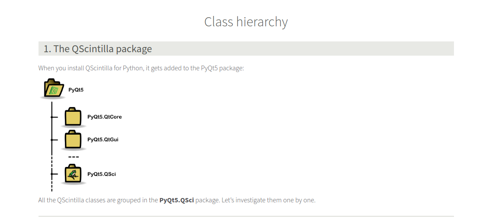
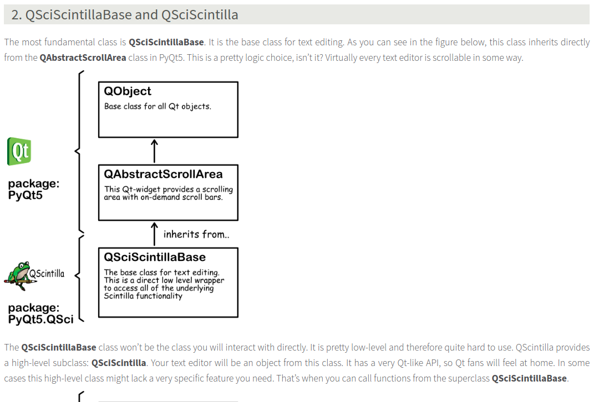

# BYOTE - Build Your Own Text Editor

> see: https://qscintilla.com/
> Follow License of the original project GPL v3
Based on Qscintilla   as learn project ot understand pyqt better
> credist: Kristof Muller and Matic Kukovec original authors.

Scintilla is a free 'source code editting component'. Implications:

> - The term "component" refers to it being a "software module". Scintilla is not a ready-to-use consumer program. It is a module that you have to plug into your own software.
> - Scintilla is aimed at "source code editing". It includes features like support for syntax styling, error indicators, code completion and call tips, ...
In fact, Scintilla is a software tool to build your own IDE! Isn't that amazing? You can find more information on the official website of Scintilla: https://www.scintilla.org/

Notepad ++ is based on Scintilla

Project requirements and installation:

- [Python](https://www.python.org/)
- [PyQt5](https://pypi.org/project/PyQt5/)
- [QScintilla](https://pypi.org/project/QScintilla/)

#### Understanding the class hierachy of QScintilla package.

On install it is added to the `PyQt5` package hierachy and the classes are grouped in the `PyQt5.QSci` namespace.
Prior understanding of how python packages are structured might help.
> see: 
> - [official docs](https://packaging.python.org/tutorials/packaging-projects/)
> - [The Hitchhikers guide](https://docs.python-guide.org/writing/structure/)
> - Python-packaging tutorial [The Joy of Packaging](https://python-packaging-tutorial.readthedocs.io/en/latest/setup_py.html)
> - Real python's [python application layouts](https://realpython.com/python-application-layouts/)

