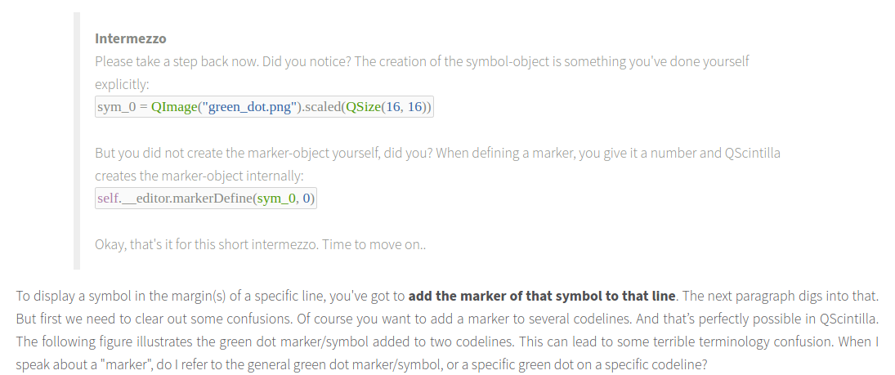

# simple text editor GUI


See source for  code explanation.
> The __`QMainWindow`__ object is the window of your GUI. You define a layout for it and stuff all the components (widgets) into the window, one after the other. We’ve got just two components here: a __`QPushButton`__ and a __`QsciScintilla`__ object. We don’t really need a button, but let’s put it there anyway. The __`QsciScintilla`__ object is what it’s all about. It is the QScintilla editor! Our simple editor won’t need a lexer or other complicated stuff. So the __`QsciLexer`__ and __`QsciAPIs`__ classes are not needed for now (remember from the intro..):
> When building a GUI, I usually start by subclassing the __QMainWindow__ class. First I define the geometry of the window, next I create a central frame: `self.__frm`. This frame will be the parent of all widgets in my GUI. I define a layout for this frame: `self.__lyt` such that all added widgets get positioned vertically, one below the other. As you already know, I create two widgets: the QPushButton and the QsciScintilla editor. I add them to the layout like this


```python
import sys

from PyQt5.Qsci import QsciScintilla
from PyQt5.QtGui import QFont
from PyQt5.QtWidgets import (QApplication, QFrame, QMainWindow,QPushButton,
                             QStyleFactory, QVBoxLayout)


class CustomMainWindow(QMainWindow):
    def __init__(self):
        super(CustomMainWindow, self).__init__()

        # Window setup
        # --------------

        # 1. Define the geometry of the main window
        self.setGeometry(300, 300, 800, 400)
        self.setWindowTitle("QScintilla Test")

        # 2. Create frame and layout
        self.__frm = QFrame(self)
        self.__frm.setStyleSheet("QWidget { background-color: #ffeaeaea }")
        self.__lyt = QVBoxLayout()
        self.__frm.setLayout(self.__lyt)
        self.setCentralWidget(self.__frm)
        self.__myFont = QFont()
        self.__myFont.setPointSize(14)

        # 3. Place a button
        self.__btn = QPushButton("Qsci")
        self.__btn.setFixedWidth(50)
        self.__btn.setFixedHeight(50)
        self.__btn.clicked.connect(self.__btn_action)
        self.__btn.setFont(self.__myFont)
        self.__lyt.addWidget(self.__btn)

        # QScintilla editor setup
        # ------------------------

        # ! Make instance of QsciScintilla class!
        self.__editor = QsciScintilla()
        self.__editor.setText("Hello\n")
        self.__editor.append("world")
        self.__editor.setLexer(None)
        self.__editor.setUtf8(True)  # Set encoding to UTF-8
        self.__editor.setFont(self.__myFont)  # Will be overridden by lexer!

        # ! Add editor to layout !
        self.__lyt.addWidget(self.__editor)

        self.show()

    ''''''

    def __btn_action(self):
        print("Hello World!")

    ''''''


''' End Class '''

if __name__ == '__main__':
    app = QApplication(sys.argv)
    QApplication.setStyle(QStyleFactory.create('Fusion'))
    myGUI = CustomMainWindow()

    sys.exit(app.exec_())

''''''
```
**Edit:** I have removed star imports from this example in favor of explicit imports
From a personal preference and good practice vantage. Most PyQt resources out there in wild internet
also qgis plugins follow this trend, but i prefer minimalist approach of importing only the 
packages and modules you use within an application. This helps understand the packages from 
which a module is inherited and lowers the maintainance cost of an application or porting, migration or 
even  upgrading to a newer package. For instance the Migration from `PyQt4` to `PyQt5` which saw widgets moved to the `QtWidgets` Module from `QtGui`. Unless you had prior knowledge of this, it would be hell migrating your legacy Qt application to recent APIs

## Extending the editor.

some usefull properties to extend the editor.
>Text wrapping automatically breaks the line, such that everything fits in the viewable window. Notice however that wrapped lines don’t increment the line number, and that’s great! Imagine the mess if your text editor starts playing around with line numbers


Possible errors that you'll encounter
Most of them are self explanatory
by removing the keyword `endFlag` should do the magic
```sh
Traceback (most recent call last):
  File "simpleTextEditor.py", line 82, in <module>
    main()
  File "simpleTextEditor.py", line 75, in main
    myGUI = CustomMainWindow()
  File "simpleTextEditor.py", line 50, in __init__
    self.__editor.setWrapVisualFlags(
TypeError: setWrapVisualFlags(self, QsciScintilla.WrapVisualFlag, startFlag: QsciScintilla.WrapVisualFlag = QsciScintilla.WrapFlagNone, indent: int = 0): 'endFlag' is not a valid keyword argument
```
and due to a typo `QsciScintilla.WrapFlagText` instead of `QsciScintilla.WrapFlagByText`
```sh
Traceback (most recent call last):
  File "simpleTextEditor.py", line 81, in <module>
    main()
  File "simpleTextEditor.py", line 74, in main
    myGUI = CustomMainWindow()
  File "simpleTextEditor.py", line 51, in __init__
    endFlag=QsciScintilla.WrapFlagByBorder, startFlag=QsciScintilla.WrapFlagText)
AttributeError: type object 'QsciScintilla' has no attribute 'WrapFlagText'
```
and
```sh
Traceback (most recent call last):
  File "simpleTextEditor.py", line 82, in <module>
    main()
  File "simpleTextEditor.py", line 75, in main
    myGUI = CustomMainWindow()
  File "simpleTextEditor.py", line 55, in __init__
    self.__editor.setWrapIndentMode(startFlag=QsciScintilla.WrapIndentFixed)
TypeError: setWrapIndentMode() takes no keyword arguments
```





Still under construction:

From Official docs [QsciScintilla class](https://www.riverbankcomputing.com/static/Docs/QScintilla/classQsciScintilla.html#ae478a896ae32a30e8a375049a3d477e0) and here at sourceforge [Scintilla folding](https://scintilla.sourceforge.io/ScintillaDoc.html#Folding)


From above sources, trying to set folding to `self.__editor` object of the simple editor
[StackOverflow thread](https://stackoverflow.com/questions/55426342/how-to-implement-indentation-based-code-folding-in-qscintilla)

```python
self.__editor.setFolding(self.__editor.BoxedFoldStyle, 4)
```
[Margin example from notes](examples/margin_example.py)
```python
import sys

from PyQt5.Qsci import QsciScintilla
from PyQt5.QtCore import QSize
from PyQt5.QtGui import QFont, QColor, QImage
from PyQt5.QtWidgets import (QApplication, QFrame, QMainWindow, QPushButton,
                             QStyleFactory, QVBoxLayout)


class CustomMainWindow(QMainWindow):
    def __init__(self):
        super(CustomMainWindow, self).__init__()

        # -------------------------------- #
        #           Window setup           #
        # -------------------------------- #

        # 1. Define the geometry of the main window
        # ------------------------------------------
        self.setGeometry(300, 300, 800, 400)
        self.setWindowTitle("QScintilla Test")

        # 2. Create frame and layout
        # ---------------------------
        self.__frm = QFrame(self)
        self.__frm.setStyleSheet("QWidget { background-color: #ffeaeaea }")
        self.__lyt = QVBoxLayout()
        self.__frm.setLayout(self.__lyt)
        self.setCentralWidget(self.__frm)
        self.__myFont = QFont()
        self.__myFont.setPointSize(14)

        # 3. Place a button
        # ------------------
        self.__btn = QPushButton("Qsci")
        self.__btn.setFixedWidth(50)
        self.__btn.setFixedHeight(50)
        self.__btn.clicked.connect(self.__btn_action)
        self.__btn.setFont(self.__myFont)
        self.__lyt.addWidget(self.__btn)

        # -------------------------------- #
        #     QScintilla editor setup      #
        # -------------------------------- #

        # ! Make instance of QSciScintilla class!
        # ----------------------------------------
        self.__editor = QsciScintilla()
        self.__editor.setText("This\n")         # Line 1
        self.__editor.append("is\n")            # Line 2
        self.__editor.append("a\n")             # Line 3
        self.__editor.append("QScintilla\n")    # Line 4
        self.__editor.append("test\n")          # Line 5
        self.__editor.append("program\n")       # Line 6
        self.__editor.append("to\n")            # Line 7
        self.__editor.append("illustrate\n")    # Line 8
        self.__editor.append("some\n")          # Line 9
        self.__editor.append("basic\n")         # Line 10
        self.__editor.append("functions.")      # Line 11
        self.__editor.setLexer(None)
        self.__editor.setUtf8(True)             # Set encoding to UTF-8
        self.__editor.setFont(self.__myFont)

        # 1. Text wrapping
        # -----------------
        self.__editor.setWrapMode(QsciScintilla.WrapWord)
        self.__editor.setWrapVisualFlags(QsciScintilla.WrapFlagByText)
        self.__editor.setWrapIndentMode(QsciScintilla.WrapIndentIndented)

        # 2. End-of-line mode
        # --------------------
        self.__editor.setEolMode(QsciScintilla.EolWindows)
        self.__editor.setEolVisibility(False)

        # 3. Indentation
        # ---------------
        self.__editor.setIndentationsUseTabs(False)
        self.__editor.setTabWidth(4)
        self.__editor.setIndentationGuides(True)
        self.__editor.setTabIndents(True)
        self.__editor.setAutoIndent(True)

        # 4. Caret
        # ---------
        self.__editor.setCaretForegroundColor(QColor("#ff0000ff"))
        self.__editor.setCaretLineVisible(True)
        self.__editor.setCaretLineBackgroundColor(QColor("#1f0000ff"))
        self.__editor.setCaretWidth(2)

        # 5. Margins
        # -----------
        # Margin 0 = Line nr margin
        self.__editor.setMarginType(0, QsciScintilla.NumberMargin)
        self.__editor.setMarginWidth(0, "0000")
        self.__editor.setMarginsForegroundColor(QColor("#ff888888"))

        # Margin 1 = Symbol margin
        self.__editor.setMarginType(1, QsciScintilla.SymbolMargin)
        self.__editor.setMarginWidth(1, "00000")
        sym_0 = QImage("icons/sym_0.png").scaled(QSize(16, 16))
        sym_1 = QImage("icons/sym_1.png").scaled(QSize(16, 16))
        sym_2 = QImage("icons/sym_2.png").scaled(QSize(16, 16))
        sym_3 = QImage("icons/sym_3.png").scaled(QSize(16, 16))

        self.__editor.markerDefine(sym_0, 0)
        self.__editor.markerDefine(sym_1, 1)
        self.__editor.markerDefine(sym_2, 2)
        self.__editor.markerDefine(sym_3, 3)

        self.__editor.setMarginMarkerMask(1, 0b1111)

        # Display a few symbols, and keep their handles stored
        handle_01 = self.__editor.markerAdd(0, 0)   # Green dot on line 0+1
        handle_02 = self.__editor.markerAdd(4, 0)   # Green dot on line 4+1
        handle_03 = self.__editor.markerAdd(5, 0)   # Green dot on line 5+1
        handle_04 = self.__editor.markerAdd(8, 3)   # Red arrow on line 8+1
        handle_05 = self.__editor.markerAdd(9, 2)   # Red dot on line 9+1


        # ! Add editor to layout !
        # -------------------------
        self.__lyt.addWidget(self.__editor)
        self.show()

    ''''''

    def __btn_action(self):
        print("Hello World!")

    ''''''


''' End Class '''

if __name__ == '__main__':
    app = QApplication(sys.argv)
    QApplication.setStyle(QStyleFactory.create('Fusion'))
    myGUI = CustomMainWindow()

    sys.exit(app.exec_())
```