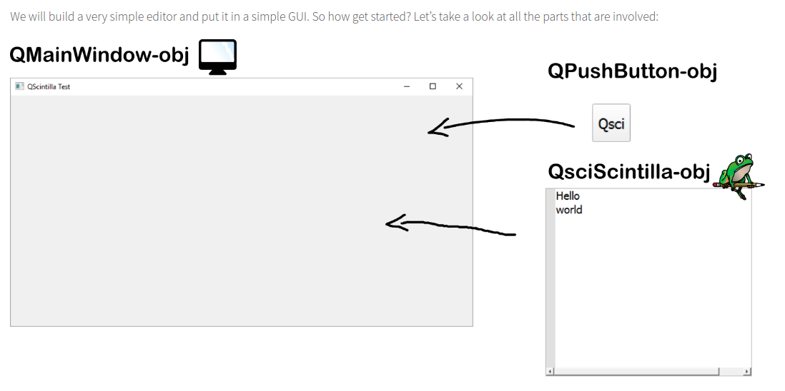
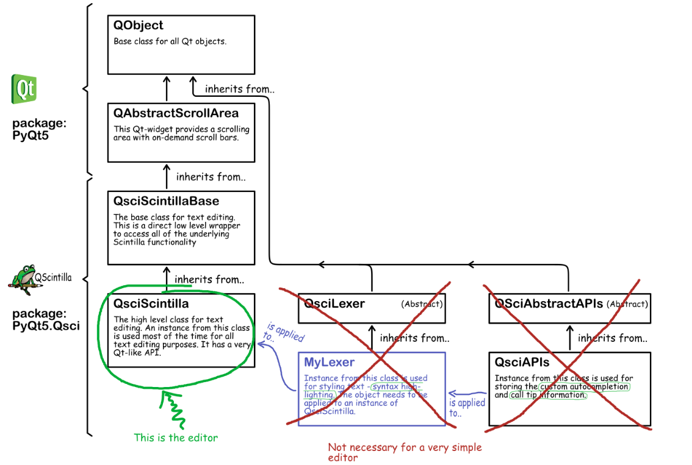

# simple text editor GUI



See source for  code explanation.
> The __`QMainWindow`__ object is the window of your GUI. You define a layout for it and stuff all the components (widgets) into the window, one after the other. We’ve got just two components here: a __`QPushButton`__ and a __`QsciScintilla`__ object. We don’t really need a button, but let’s put it there anyway. The __`QsciScintilla`__ object is what it’s all about. It is the QScintilla editor! Our simple editor won’t need a lexer or other complicated stuff. So the __`QsciLexer`__ and __`QsciAPIs`__ classes are not needed for now (remember from the intro..):
> When building a GUI, I usually start by subclassing the __QMainWindow__ class. First I define the geometry of the window, next I create a central frame: `self.__frm`. This frame will be the parent of all widgets in my GUI. I define a layout for this frame: `self.__lyt` such that all added widgets get positioned vertically, one below the other. As you already know, I create two widgets: the QPushButton and the QsciScintilla editor. I add them to the layout like this



```python
import sys
from PyQt5.QtWidgets import *
from PyQt5.QtCore import *
from PyQt5.QtGui import *
from PyQt5.Qsci import *


class CustomMainWindow(QMainWindow):
    def __init__(self):
        super(CustomMainWindow, self).__init__()

        # Window setup
        # --------------

        # 1. Define the geometry of the main window
        self.setGeometry(300, 300, 800, 400)
        self.setWindowTitle("QScintilla Test")

        # 2. Create frame and layout
        self.__frm = QFrame(self)
        self.__frm.setStyleSheet("QWidget { background-color: #ffeaeaea }")
        self.__lyt = QVBoxLayout()
        self.__frm.setLayout(self.__lyt)
        self.setCentralWidget(self.__frm)
        self.__myFont = QFont()
        self.__myFont.setPointSize(14)

        # 3. Place a button
        self.__btn = QPushButton("Qsci")
        self.__btn.setFixedWidth(50)
        self.__btn.setFixedHeight(50)
        self.__btn.clicked.connect(self.__btn_action)
        self.__btn.setFont(self.__myFont)
        self.__lyt.addWidget(self.__btn)

        # QScintilla editor setup
        # ------------------------

        # ! Make instance of QsciScintilla class!
        self.__editor = QsciScintilla()
        self.__editor.setText("Hello\n")
        self.__editor.append("world")
        self.__editor.setLexer(None)
        self.__editor.setUtf8(True)  # Set encoding to UTF-8
        self.__editor.setFont(self.__myFont)  # Will be overridden by lexer!

        # ! Add editor to layout !
        self.__lyt.addWidget(self.__editor)

        self.show()

    ''''''

    def __btn_action(self):
        print("Hello World!")

    ''''''


''' End Class '''

if __name__ == '__main__':
    app = QApplication(sys.argv)
    QApplication.setStyle(QStyleFactory.create('Fusion'))
    myGUI = CustomMainWindow()

    sys.exit(app.exec_())

''''''
```
**Edit:** I have removed star imports from this example in favor of explicit imports
From a personal preference and good practice vantage. Most PyQt resources out there in wild internet
also qgis plugins follow this trend, but i prefer minimalist approach of importing only the 
packages and modules you use within an application. This helps understand the packages from 
which a module is inherited and lowers the maintainance cost of an application or porting, migration or 
even  upgrading to a newer package. For instance the Migration from `PyQt4` to `PyQt5` which saw widgets moved to the `QtWidgets` Module from `QtGui`. Unless you had prior knowledge of this, it would be hell migrating your legacy Qt application to recent APIs