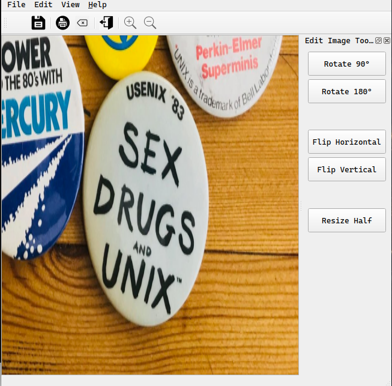

# Simple photo Editor

dummy project to see the use of  `QDockWidget` `QStatusBar`classes among others as well  as  creating submenus and checkable menu items.

Book: Beginning PyQt

>A `QWidget` is the base class for all drawable classes in Qt. Any `QWidget`-based class can be shown as a window by showing it when it has no parent.
>A `QDialog` is based on `QWidget`, but designed to be shown as a window. It will always appear in a window, and has functions to make it work well with common buttons on dialogs (accept, reject, etc.).
>`QMainWindow` is designed around common needs for a main window to have. It has predefined places for a menu bar, a status bar, a toolbar, and other widgets. It does not have any built-in allowances for buttons like `QDialog`does.
[stackexchange](https://stackoverflow.com/questions/3298792/whats-the-difference-between-qmainwindow-qwidget-and-qdialog)

[editor.py](./editor.py) goes through the set up of the gui objects
[main.py](./main.py) is the app photo gui editor for the project.

Note: icons used are sought randomly from internet and are subject to licensing by their authors.
Improvements to Image Editor:

- add zoomIn, zoomOut and pan actions.
- add scroll area if image is too large.
- MDI image viewer and sync  multiple images

**ideas and improvements**
[@baoboa image viewer](https://github.com/baoboa/pyqt5/blob/master/examples/widgets/imageviewer.py)
[@acbetter Image Viewer.py](https://gist.github.com/acbetter/32c575803ec361c3e82064e60db4e3e0)
[@acbetter QImageViewSync.py](https://gist.github.com/acbetter/e7d0c600fdc0865f4b0ee05a17b858f2)
[MDI Image Viewer](http://tpgit.github.io/MDIImageViewer/imageviewer.html)

snapshot of application

