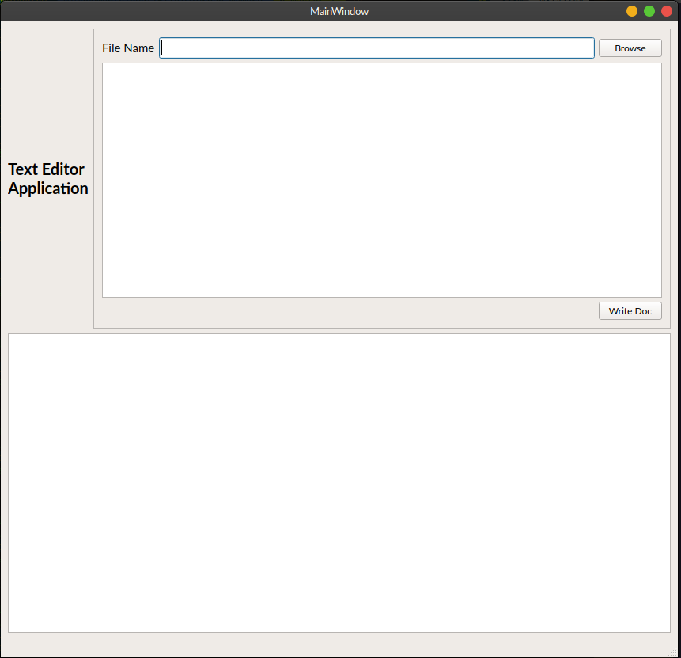

# Practice to tutorial follow along on PyQt5 file IO application

## to understand Qt framework MVC implementation using PyQT5

tutorial source [smithEdu](http://www.science.smith.edu/dftwiki/index.php/PyQt5_Tutorial:_A_Window_Application_with_File_IO)

Personal prference to type word for word to help in futher internalising what is going around.
feel free to dowload modify: Better yet check the original tutorial
tweak the files.
basic oop python knowledge is fit

As suggested in the original docs, after compiling the generated designer
 *.ui file using the pyuic command line tool

```bash
pyuic5 -x  *.ui -o *.py
```

the changes are significant to be made sa highlighted to enable pyQt5 signal slots connections in the generated *.py file

1. import section

    ```python
    from PyQt5.QtCore import QObject, pyqtSlot
    ```

2. change class object/argument  from ```object``` to ```Qobject```
3. include the following methods and @ decorators after the retranslateUi method
   

    ```python
    @pyqtSlot()
    def browseSlot(self):
        pass

    @pyqtSlot()
    def writeDocSlot(self):
        pass

    @pyqtSlot()
    def returnPressedSlot(self):
        pass
    ``````self```
    **Resulting Error**

    ```bash
    Traceback (most recent call last):
        File "mainwindow.py", line 123, in <module>
            ui.setupUi(MainWindow)
        File "mainwindow.py", line 92, in setupUi
            self.pushButton.clicked.connect(MainWindow.browseSlot)
        AttributeError: 'QMainWindow' object has no attribute 'browseSlot'
    ```

    **After the indicated changes**

    

### Model-View-Controller

Qt doesn't directly adhere to the MVC paradigm but explicitly explains its implementation as close to it using Controller-view where Model and control parts of the mvc concept is bundled under Controller and view part remains separately as the view .

ideally the UI part is kept separate from  the application logic and linked to each component using well defined links.
